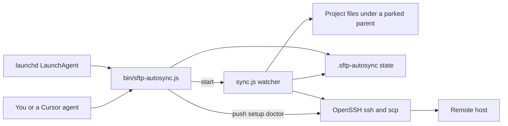
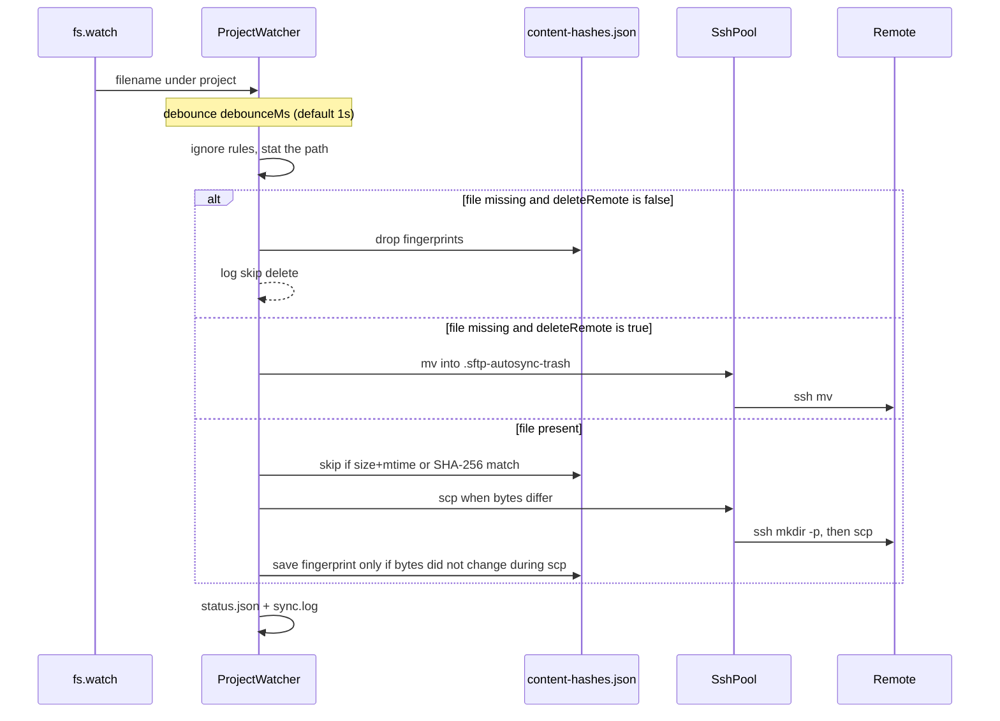
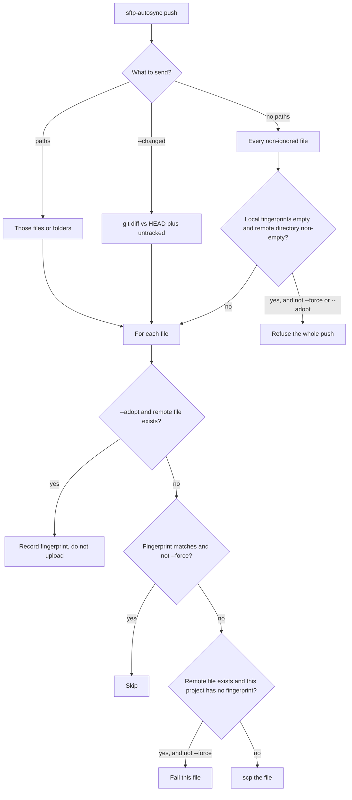
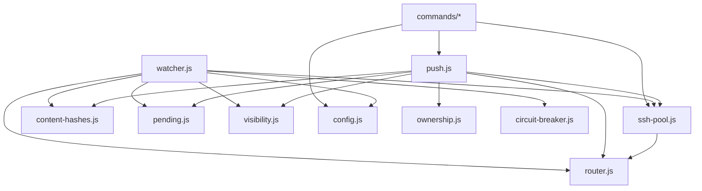

# SFTP Auto-Sync — codebase review

Reviewed against `main` at `0256f61` (8 Oct 2026). Package version is **0.4.0**. The newest git tag is **v0.3.0**, so the manual-mode, doctor, retry, and remote-safety work is on `main` and not yet tagged.

This file is a map of the repository: what the tool is, how the pieces fit, and what is incomplete or risky. User-facing setup stays in [README.md](README.md).

---

## 1. What this project is

`sftp-autosync` is a **one-way, local-to-remote file uploader for macOS**. It is modeled on Laravel Valet’s “park a parent folder” idea:

1. You park a parent directory (default `~/Sites`).
2. Each **immediate child** of that parent can have its own `.sftp-autosync/sync-config.json`.
3. Files are sent with the system **OpenSSH** client (`ssh` + `scp`), reusing one **ControlMaster** connection per user, host, port, and key.

It is not a bidirectional sync (there is no pull), not an SFTP library client, and not a general rsync replacement. Password login is unsupported. Auth is SSH key only (`BatchMode=yes`).

There are two sync modes:

| Mode | Config value | What happens |
| --- | --- | --- |
| Manual | `"mode": "manual"` | Nothing is watched. You upload with `sftp-autosync push`. This is the default for new setups. |
| Autosync | `"mode": "auto"`, or the field omitted on older configs | A daemon watches the project and uploads on change. |

Older configs with no `mode` stay on autosync so existing daemons do not silently stop.

Runtime is **Bun** (ESM, no npm dependencies). The interactive prompts are an in-repo TTY UI (`lib/prompts.js`), not `@clack/prompts`.

Rough size: about **6,900 lines of source** and **4,400 lines of tests** across 65 JavaScript files. `bun test` runs **205 tests in 28 files**; they passed in this review.

---

## 2. What it can do now

### Day-to-day commands

| Command | Role |
| --- | --- |
| *(no args, in a terminal)* | Arrow-key menu of the commands below |
| `init` | Write global config, create parked parents, optionally install a login LaunchAgent |
| `setup` | Write a project’s `sync-config.json`, gitignore `.sftp-autosync/`, optionally probe SSH and seed or upload |
| `push` | Upload the whole project, git-changed files (`--changed`), or named paths. `--adopt` records fingerprints without uploading. `--force` re-uploads and may overwrite unowned remote files |
| `start` | Foreground watcher (`sync.js`) |
| `restart` | `launchctl unload` + `load` of the existing plist |
| `status` | LaunchAgent state plus each project’s last op, sticky error, and pending retry count |
| `doctor` | Read-only health pass: plist, loaded daemon, keys, shallow remote paths, corrupt stores, sticky errors, one SSH probe per identity |
| `list` | Parked parents and projects (mode, host, remote). Does not print key paths |
| `log` | Tail daemon stdout/stderr or a project `sync.log` |
| `config` | Print, path, or `$EDITOR` for global or project JSON |

`launchd/install.js --uninstall` removes the agent. That is **not** a CLI subcommand.

### Upload behavior

- Whole-file `scp` of each changed file. Parent directories are created with `mkdir -p`.
- Skip when the stored fingerprint’s **size + mtime** match, otherwise compare **SHA-256**. A same-content editor rewrite does not hit the server, including after a daemon restart.
- If the file changes again while `scp` is reading it, the fingerprint is not saved and the path is rescheduled.
- Local deletes do **not** remove remote files unless `deleteRemote: true`. When that is on, the remote path is **moved** into `<remotePath>/.sftp-autosync-trash/<timestamp>/…`, not `rm`’d. Trash directories older than 7 days are pruned.
- Remote paths used for deletes must be at least three segments deep (`/var/www/my-app`). `/`, `/var`, and `/var/www` are refused.
- The first push into a **non-empty remote with no local fingerprints** is refused unless you `--adopt`, `--already-synced` (setup seed), or `--force`. A remote file with no fingerprint is also refused per file, same flags.
- Several projects (and route targets) that would write the same or overlapping remote tree on the same `user@host:port` log a warning. The daemon does not stop them.
- Failed autosync ops go into `.sftp-autosync/pending.json` and retry at 1s, 5s, 30s, then every 2 minutes. Three connection failures in a row open an in-memory circuit breaker for 2 minutes and macOS notifies once.
- `status.json` keeps a **sticky `lastError`** until that same file succeeds, so a later successful file does not hide the failure.
- macOS notifications: failure on by default, “still running” after `slowMs` (default 2s), success off unless `notify.onSuccess` is true.

### Extra surfaces

- Cursor agent skill: `skills/sftp-autosync/SKILL.md` (agents should call `push --changed`, never the TTY menu).
- Editor tasks: `examples/vscode/tasks.json` (current file, git-changed, or whole project).
- Homebrew HEAD formula: `Formula/sftp-autosync.rb`.
- Local Docker OpenSSH sandbox: `bun run e2e:up`, `e2e:start`, `e2e:isolate`, `e2e:down`. Two parked projects (`demo` and `other`) prove one project’s upload/delete does not touch the other remote tree.

### On-disk state

Global (never in the repo):

```text
~/Library/Application Support/sftp-autosync/config.json
~/Library/Caches/sftp-autosync/cm/<16-hex>     ControlMaster sockets
~/Library/Logs/sftp-autosync/out.log
~/Library/Logs/sftp-autosync/err.log
~/Library/LaunchAgents/com.sftp-autosync.plist
```

Per project (gitignored; treat as secrets — it contains host, user, and key path):

| File | Role |
| --- | --- |
| `.sftp-autosync/sync-config.json` | Host, port, user, key, `remotePath`, `mode`, optional `deleteRemote`, `ignore`, `routes` |
| `.sftp-autosync/content-hashes.json` | Fingerprints after a successful upload or seed. Locked while read-modify-written |
| `.sftp-autosync/pending.json` | Failed ops waiting to retry. Absent when the queue is empty |
| `.sftp-autosync/sync.log` | Append-only history. Rotates to `sync.log.1` at 1 MiB |
| `.sftp-autosync/status.json` | Latest op plus sticky `lastError` |

Corrupt hash or pending files are renamed to `*.corrupt.<timestamp>` instead of being treated as an empty store (which would risk re-uploading or dropping retries).

---

## 3. Picture of the system

### Who talks to whom



`start` does not watch inside the CLI process. It spawns `bun sync.js`, which is also what the LaunchAgent runs (`sftp-autosync start`, or `bun bin/sftp-autosync.js start` if the CLI is not on `PATH`).

### Repository map

```text
sftp-autosync/
├── bin/sftp-autosync.js          CLI entry: menu + dispatch
├── sync.js                       Long-running watcher process
├── config.example.json           Global defaults copied by init
├── sync-config.example.json      Documented project config
├── lib/
│   ├── cli.js                    Help text, TTY check, SSH key discovery
│   ├── prompts.js                In-repo text / select / confirm prompts
│   ├── commands/                 One file per CLI command
│   ├── config.js                 Load configs, discover parked projects, collision checks
│   ├── setup.js                  Write project config, gitignore, SSH probe
│   ├── init.js                   Write global config, mkdir parents
│   ├── paths.js                  Application Support paths, legacy config migration
│   ├── watcher.js                fs.watch, debounce, retries, hash persistence
│   ├── push.js                   Explicit uploads (push command and setup bootstrap)
│   ├── ssh-pool.js               ControlMaster, scp, mkdir, trash, remote probes
│   ├── router.js                 Local path → remote path, longest route prefix wins
│   ├── remote-path.js            Refuse shallow or ".." remote paths
│   ├── ownership.js              Block push into a non-empty unowned remote
│   ├── content-hashes.js         SHA-256 fingerprints, file lock, seed
│   ├── pending.js                Retry queue and backoff
│   ├── circuit-breaker.js        Pause a dead SSH identity
│   ├── visibility.js             sync.log, status.json, osascript notifications
│   ├── classify-ssh-error.js     auth / connect / permission / space / hostkey
│   ├── ignore.js                 Segment names and simple * / ? globs
│   ├── git-changed.js            git diff + untracked for push --changed
│   └── launchd-install.js        Render plist, load / unload / reload
├── launchd/                      plist template + install script
├── e2e/                          Docker sshd, two parked projects, isolation check
├── examples/vscode/tasks.json
├── skills/sftp-autosync/SKILL.md
└── Formula/sftp-autosync.rb
```

### How one file change becomes an upload

Only **autosync** projects take this path. Manual projects are logged once as skipped and never watched.



If `fs.watch` delivers an event with no filename (batched FSEvents), the watcher compares the live tree to the paths it remembered and schedules every difference.

### How `push` decides to upload



The watcher upload path does **not** use the ownership checks in this diagram. Autosync will `scp` over whatever is at the mapped remote path. The guards apply to `push` and to setup’s initial upload.

### Parked layout and routing

Discovery only looks at **direct children** of each parent. Dot-directories are skipped. A nested repo such as `~/Sites/monorepo/packages/web` is invisible unless you park `packages` itself or give `web` its own parent entry.

```text
~/Sites                          parked parent
├── shop                         project  →  /var/www/shop
│   ├── index.html               project remotePath + relative path
│   └── shared-assets/app.css    route local "shared-assets"
│                                → /var/www/shared-assets/app.css
└── blog                         another project, own host and remotePath
```

Longest `routes[].local` prefix wins. Everything else is `<remotePath>/<relative path>`. Projects that share `user@host:port` and the same private key share one ControlMaster socket.

### Module dependency (simplified)



`push.js` calls `requestPendingDrain()` in `watcher.js`. That only reaches a watcher **in the same process**. See the gaps section.

---

## 4. Runtime in more detail

### Global config

`config.example.json` is copied to Application Support on `init`. Fields that matter:

| Field | Default | Effect |
| --- | --- | --- |
| `parents` | `["~/Sites"]` | Folders whose immediate children are projects |
| `ignore` | `.git`, `node_modules`, `.DS_Store`, `.sftp-autosync`, `*.tmp`, `*.swp` | Merged with each project’s `ignore` |
| `debounceMs` | `1000` | Coalesce rapid saves |
| `rescanMs` | `15000` | Re-read which projects exist and whether their JSON changed |
| `concurrency` | `3` | Parallel `ssh`/`scp` jobs **per SSH identity** |
| `notify.*` | failure on, success off, slow at 2s | macOS `osascript` notifications. `delayMs` is an artificial pause for demos |
| `ssh.controlPersist` | `10m` | How long the master connection stays up after idle |
| `ssh.connectTimeout` | `15` | Seconds |
| `ssh.controlDir` | `~/Library/Caches/sftp-autosync/cm` | Socket directory. Names are a 16-hex SHA-1 prefix so they fit macOS socket path limits |

A pre-0.2.0 `config.json` sitting next to the package is copied into Application Support once, if the user file is missing.

### Project config

Required: `host`, `username`, `remotePath`, `privateKeyPath`. Port defaults to 22. `mode` defaults to `auto` when missing or unrecognized, and to `manual` when `setup` creates a new file. `deleteRemote` is stored only when true.

`setup --manual` or `--autosync` with no host/path flags only patches `mode` on an existing file. `--force` rewrites the connection fields and **keeps existing `routes`** if you do not pass new ones. There is no CLI flag for routes or per-project ignore; those are hand-edited JSON. The daemon picks up a changed project file on the next rescan (about 15s) or when the parent directory watch fires. Global config changes need `restart`.

### SSH pool

`SshPool` is a queue in front of `Bun.spawn`:

1. `ssh -O check` the ControlMaster; if it is down, `ssh -MNf` opens one.
2. Jobs for one identity run up to `concurrency` at a time. Different hosts do not share that limit.
3. A non-zero exit drops the master (`ssh -O exit`) and retries the command once.
4. `remotePathExists` / directory probes use `ssh test`. Exit `1` means “no”. Any other exit is an SSH failure, not “missing”.
5. Upload: `mkdir -p` the parent (cached for the life of the process), then `scp`.
6. Deletes go to trash via `ssh mv`. `assertSafeRemoteTreePath` runs before a tree move.

Host keys use `StrictHostKeyChecking=accept-new` (first connect is stored, changed keys still fail). `SSH_ASKPASS_REQUIRE=never` so launchd cannot hang on a password prompt.

### Ignore rules

`shouldIgnoreRel` is small on purpose:

- Anything under `.sftp-autosync/` or named `sync-config.json` is always ignored.
- A pattern with `*` or `?` is matched against the basename **and** the full relative path. `*` means `.*` in a regex. There is no `**`.
- Any other pattern matches if it equals a path segment (`node_modules` ignores that folder anywhere).

This is not gitignore syntax. No negation (`!`), no anchored directory rules, no comments.

### Fingerprints

Each file entry is `{ hash, size, mtimeMs }` (older stores may be a bare hash string). Comparison is local only. The tool never checksums the remote file. If someone edits the server directly, the next local save still overwrites it, and an unchanged local file is never re-uploaded.

Writers (watcher flush, `push`, seed) share `content-hashes.json.lock` (exclusive `wx` create, pid inside, 5s wait, stale locks broken only when the recorded pid is dead or the lock has no pid and is older than 30s). Updates are load → merge → write temp → rename, so a watcher flush cannot wipe a fingerprint `push` just saved.

### Retries and the circuit breaker

Backoff after a failure: **1s, 5s, 30s, then 2 minutes forever**. There is no max attempt count.

The circuit breaker counts **connection-shaped** errors only (`exit 255`, timeout, refused, reset, broken pipe, and similar). `permission denied` without `exit 255` does not open it. After 3 connection failures the identity is blocked for 2 minutes, then one probe is allowed. State is **in memory** and disappears when the daemon restarts. `pending.json` survives the restart and is drained on startup.

A permission or disk-space error is still queued and retried every 2 minutes. Failure notifications are suppressed on retries (`isRetry`); the first failure still notifies. `doctor` and `status` keep showing `lastError`.

### LaunchAgent

`KeepAlive` + `RunAtLoad`. Logs go to `~/Library/Logs/sftp-autosync/`. The plist `PATH` is `/usr/bin:/bin:/usr/sbin:/sbin` plus Bun’s directory, which is enough for macOS `ssh`, `scp`, and `osascript`. It sets `HOME` and does **not** set `SSH_AUTH_SOCK`, so a passphrase-protected key that works in your terminal often fails under launchd unless the key has no passphrase or the agent socket is arranged some other way.

### Visibility and errors

`ProjectVisibility.track` writes `uploading` / `deleting` / `mkdir`, then `ok` or `error`, and mirrors a line to stdout (which launchd captures in `out.log`). SSH text is classified for `status.json`:

| Kind | Examples |
| --- | --- |
| `auth` | publickey denied |
| `connect` | refused, timeout, resolve failure |
| `permission` | remote permission after auth |
| `space` | quota, no space |
| `hostkey` | known_hosts mismatch |

---

## 5. Safety model (what already exists)

These are the protections added so a bad path is less likely to destroy a server:

- New setups default to **manual**. The watcher does not run, so an idle daemon cannot delete or upload.
- **`deleteRemote` defaults off.** Opt-in deletes move files to trash instead of `rm`.
- **Shallow remote paths** are rejected at setup and flagged by `doctor`. Tree trash re-checks before `mv`.
- **`push` refuses** a non-empty remote when this project has no fingerprints, and refuses a single remote file that exists but was never fingerprinted.
- Setup `--force` overwrites local JSON only. It does not authorize overwriting those remote files. `--already-synced` against an empty remote is refused unless setup `--force` is also set.
- **Cross-project isolation** is by construction: each project watcher only maps paths through its own `remotePath` and `routes`. The e2e check writes in `demo` and asserts `other`’s remote tree is unchanged.
- **Collision warnings** fire when two projects’ remotes are equal or one is a prefix of the other on the same identity.
- Meta files are gitignored by `setup` and hard-ignored by the matcher so credentials and logs are not uploaded.
- Hash files use a lock and atomic rename. Corrupt JSON is quarantined.

What this does **not** guarantee:

- Autosync uploads do not ask whether the remote file is “owned”.
- Collision warnings do not block the write.
- Trash prune runs `find … -mtime +7 -exec rm -rf` over SSH. A prune failure is swallowed.
- `accept-new` trusts the host key on first contact.
- Symlinks are treated as files (`readdir` sees the link; later `stat` / `scp` follow it), so a link can upload bytes that live outside the project.

---

## 6. What is missing, fragile, or worth improving

Ordered by how much they matter in real use. None of these are marked TODO in the source; they come from reading the control flow.

### Behavior gaps that can surprise you

**Failed `push` does not wake the launchd daemon.** `requestPendingDrain` only sees a `ProjectWatcher` in the same process. The unit test covers that in-process case. In normal use, `sftp-autosync push` and the LaunchAgent are different processes. A failed push still writes `pending.json`, but the running daemon does not look at that file again until it restarts, the project config changes, or it handles some other failure of its own. Rescan (every 15s) reloads config; it does not re-arm the queue for an unchanged project.

**Manual mode never drains `pending.json`.** The watcher skips manual projects entirely, and nothing else retries them. `status` can still show `pending` and `nextRetry`, which reads like an automatic retry. For manual projects the only retry is to run `push` again.

**Retries never stop.** After the backoff hits 2 minutes, a permanently bad file (permission, full disk, bad route) is retried forever. The circuit breaker only pauses connection failures, and only until the process exits.

**Autosync can overwrite remote files the push command would refuse.** Ownership checks live in `push.js` / setup bootstrap. The watcher’s `#handle` uploads whenever the local hash differs.

**No remote drift detection.** Fingerprints are local. A file changed only on the server is never downloaded, and it is not protected from the next local upload.

**Symlinks.** A symlink to a file is uploaded as the target’s contents under the link’s relative name. A symlink to a directory becomes a remote directory create, not a walked tree. There is no “copy the link itself” mode and no check that the target stays inside the project.

**Passphrase keys vs launchd.** The plist does not forward `SSH_AUTH_SOCK`. Autosync at login is reliable for keys with an empty passphrase. The README’s “prefer ssh-agent” advice does not match what the agent environment actually has.

**`doctor` fails when launchd is absent.** Both “plist installed” and “launchd loaded” are hard failures. That fights the recommended manual-only setup, where launchd is optional. A manual user who did everything right still gets a failing doctor.

**Interactive hints ignore the mode you just picked.** The initial-sync prompt still says “then watch for changes” and “upload only when files change” even when the project is manual.

**The bare menu runs commands with no extra arguments.** Choosing `push` uploads the **entire** current project (subject to the ownership guard). Choosing `start` starts a second foreground watcher if launchd is already running. The agent skill warns about the second watcher; the menu does not.

### Product holes (not implemented)

- **No download / pull / two-way sync**, and no dry-run that prints the file list without sending it.
- **No `stop` or `uninstall` in the CLI.** Stopping the daemon is `launchctl unload` or the install script’s `--uninstall`.
- **Routes and per-project ignore are not in `setup`.** You edit JSON. There is no prompt and no `--route` flag.
- **Only immediate children of a parked parent.** No nested projects, no dot-directories, no “sync this arbitrary folder” without parking its parent.
- **One `scp` per file**, full file every time. Thousands of small files, or large media, will be slow. Hashing reads the whole file into memory, then `scp` reads it again.
- **Ignore syntax is not gitignore.** You cannot reuse a project’s `.gitignore`, and you cannot negate a pattern.
- **No rename tracking.** A rename is a new upload plus, only if `deleteRemote` is on, a trash of the old path.
- **Deletes are not part of `push --changed`.** Git deletions are filtered out on purpose.
- **macOS only.** Launchd paths, `osascript`, FSEvents recursive `fs.watch`, and the Homebrew formula are all macOS assumptions. Nothing targets Linux or Windows.
- **No CI.** Tests and the Docker sandbox exist; nothing in the repo runs them on push. The sandbox is manual (`e2e:up` needs Docker) and is not part of `bun test`.
- **0.4.0 is not released as a tag.** `Formula/sftp-autosync.rb` still talks about pinning `v0.3.0`. HEAD installs track `main`.

### Smaller code and UX nits

- `TRASH_RETENTION_MS` in `ssh-pool.js` is unused. Pruning is `find -mtime +7`, which follows directory mtime over SSH, and errors are ignored.
- `loadBaselineFingerprints` in `ownership.js` is unused. `upsertPendingOp` is tested but the watcher never calls it, so a new local edit does not reset backoff; the edit is handled directly and a failure just increments `attempts`.
- `status` shows host and remote, not `mode` or `deleteRemote`. `list` shows mode, not pending work.
- `removeDir` (real `rmdir`, not trash) is only used from tests. Production deletes go through trash.
- Log rotation keeps a single `sync.log.1`.
- Invalid numeric config (`debounceMs`, `port`) becomes `NaN` and is not rejected.
- Notifications shell out to `osascript` with escaped quotes. Titles and bodies are short; this is fine for local notifications and is not a remote shell.
- The trash `find` command is built as a remote `sh -c` string. Single quotes in the path are escaped. It is still a shell command, unlike `mkdir` / `mv` / `scp`, which pass argv.

---

## 7. How the tests cover it

| Area | Where | Style |
| --- | --- | --- |
| Watcher debounce, deletes, manual skip, isolation, retries, circuit open | `lib/watcher*.test.js` | Fake timers / fake pool, temp dirs |
| Push ownership, adopt, pending | `lib/push.test.js`, `lib/push.retry.test.js` | Fake pool |
| SSH argv, trash vs rmdir, master lock, probes | `lib/ssh-pool.test.js` | Injected `spawn`, no real SSH |
| Hashes, lock, corrupt quarantine | `lib/content-hashes.test.js` | Real temp files |
| CLI parsing and command output | `lib/commands/*.test.js`, `lib/cli.test.js` | Injected IO and `launchctl` |
| Prompts | `lib/prompts.test.js` | Fake stdin |
| Git changed | `lib/git-changed.test.js` | Fake git plus two tests that run real `git` |
| Launchd plist args and reload | `launchd/install.test.js` | Injected `launchctl` |
| Two real remotes | `e2e/isolation-check.js` | Docker, not part of `bun test` |

The suite is strong on safety regressions (shallow paths, unowned overwrite, corrupt stores, cross-project isolation, retry storms). It does not cover a real remote, launchd, notifications, or symlink behavior. The two real-git tests need permission to create `.git/hooks` (they fail in a sandbox that blocks that, and pass otherwise).

---

## 8. Suggested reading order

If you are changing upload behavior, read in this order:

1. `lib/commands/push.js` and `lib/push.js` — the safe explicit path.
2. `lib/ownership.js` and `lib/remote-path.js` — the guards.
3. `lib/ssh-pool.js` — what actually runs on the server.
4. `lib/watcher.js` — the same transfers, plus debounce, deletes, and retries. This file is the largest and the easiest to get wrong.
5. `lib/content-hashes.js` — why a second save does not upload.
6. `lib/commands/setup.js` — how a project is allowed to start.

If you are changing the CLI surface, start at `bin/sftp-autosync.js`, then the matching file in `lib/commands/`.

---

## 9. A sensible order to improve it

Not a commitment — just the order that matches how the code is already shaped.

1. **Make retries honest.** Drain `pending.json` from the daemon on the existing 15s rescan (or a file watch on `pending.json`), and do not advertise `nextRetry` for manual projects. Cap attempts, or stop retrying `permission` / `space` / `auth` / `hostkey` instead of looping every 2 minutes.
2. **Apply the push ownership check to autosync uploads**, or document in `doctor` that autosync will overwrite. Same for symlink targets that resolve outside the project.
3. **Teach `doctor` that launchd is optional** when every project is manual, and add `stop` / `uninstall` next to `restart`.
4. **Forward `SSH_AUTH_SOCK` into the plist** (or document a concrete launchd recipe) so passphrase keys match the README.
5. **Put routes and ignore in `setup`**, or at least stop the initial-sync hints from talking about watching when mode is manual.
6. **Tag 0.4.0 and point the Homebrew formula at that tarball** when you want a stable install. Add a small GitHub Actions run of `bun test` so the 205 tests are not only local.
7. Later, only if you need it: dry-run, gitignore import, pull, and something faster than per-file `scp` for large trees. Those are new products, not fixes of the current one.
